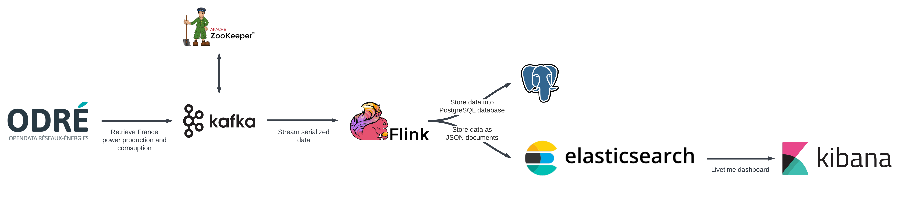
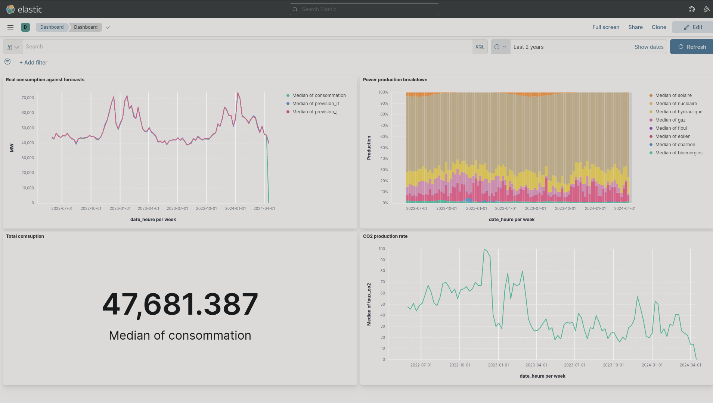

<div id="top"></div>

<!-- PROJECT SHIELDS -->

[](https://www.python.org/)
[](https://www.java.com/)
[](http://creativecommons.org/publicdomain/zero/1.0/)

<!-- PROJECT LOGO -->

<br />

<div align="center">
    <a href="https://github.com/Luunynliny/eCO2mix-Streaming">
        
    </a>
    <h3 align="center">eCO2mix-Streaming</h3>
    <p align="center">
        France power production and comsuption monitoring
    </p>
</div>

<!-- ABOUT THE PROJECT -->

## About

### Architecture

<div align="center">
    
</div>

### Dashboard

<div align="center">
    
</div>

<p align="right"><a href="#top"><i>back to top</i></a></p>


<!-- GETTING STARTED -->

## Getting started

### Prerequisites

Prior to installing the project, you need to download and setup Git and Docker, referring to the following
documentation:

- https://git-scm.com/book/en/v2/Getting-Started-Installing-Git
- https://docs.docker.com/engine/install/

### Installation

1. Clone the repository
2. Run Docker compose

```bash
docker compose up
```

3. Go to http://0.0.0.0:5601/app/dashboards and select the available dashboard.

<p align="right"><a href="#top"><i>back to top</i></a></p>

## License

Distributed under the Creative Commons Zero v1.0 Universal License. See `LICENSE` for more information.

<p align="right"><a href="#top"><i>back to top</i></a></p>

<!-- RESOURCES -->

## Resources

Ganiyu, Y. (2023, December 4). Realtime streaming with Apache Flink: End to end data engineering project.
YouTube. https://youtu.be/deepQRXnniM?si=nOpgyGbQEY_-fU0D

RTE. (n.d.). Données éco2mix Nationales Temps réel. Open Data Réseaux Énergies (
ODRÉ). https://odre.opendatasoft.com/explore/dataset/eco2mix-national-tr/information/?disjunctive.nature

<p align="right"><a href="#top"><i>back to top</i></a></p>